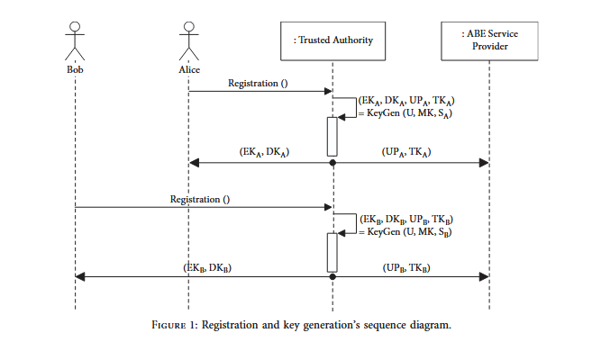
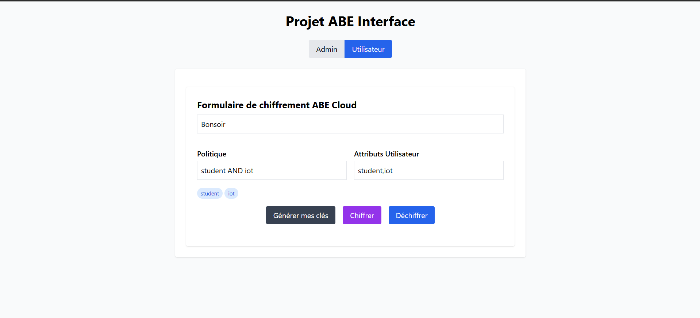
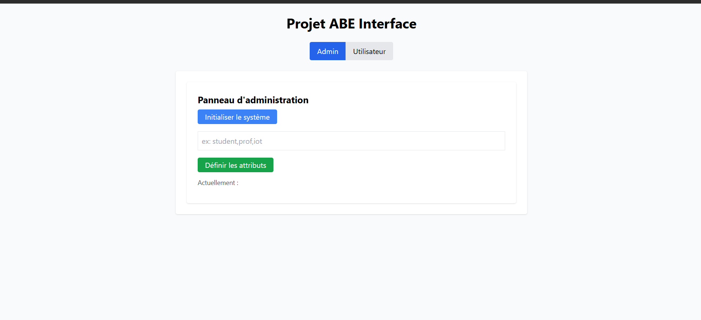

# Rapport de Projet – PJI

## Informations Générales

- **Étudiant :** Aymane Essajidi  
- **Email :** aymane.essajidi.etu@univ-lille.fr  
- **Encadrant :** Hassan Elgafif  
- **Email :** hassan.elgafif@gmail.com  
- **Titre :** Externalisation sécurisée du chiffrement basé sur les attributs (ABE) via un webservice cloud

- **git :** https://github.com/Essajidi-Aymane/Pji-25.git

## Objectif du Projet

Ce projet s'inscrit dans la continuité directe des travaux de recherche de mon encadrant, Hassan Elgafif, portant sur les schémas **CP-ABE (Ciphertext-Policy Attribute-Based Encryption)** avec externalisation du chiffrement et du déchiffrement. L’objectif principal est de transformer les modèles théoriques et algorithmes définis dans l’article publié (2021) en une application fonctionnelle en **Java**, intégrée à un **webservice cloud** et accessible via une interface utilisateur graphique moderne.

Le but est de :
- Permettre un chiffrement et déchiffrement délégué à un serveur sans compromettre la confidentialité des données,
- Alléger la charge computationnelle côté client, en particulier pour les environnements à ressources limitées (IoT),
- Fournir une API REST et une interface graphique conviviale.
## Technologies et Librairies Utilisées

### Backend
- **Langage :** Java
- **Framework :** Spring Boot
- **Librairies de cryptographie :**
  - JPBC (Java Pairing-Based Cryptography)
  - Bouncy Castle
- **Sécurité & API :**
  - Spring Security
- **Déploiement & Outils :**
  - Docker
  - Postman
  - Git
  - Jira Software Pour la gestion des teches et suivi de mon encadrant.

### Frontend
- **Langage :** JavaScript / TypeScript
- **Framework :** React.js
- **Librairies UI :**
  - TailwindCSS
  - Axios pour les appels API
 

---
## Architecture du Système

Le système est composé de :

- **Client (React):** envoi des requêtes (chiffrement, déchiffrement) et réception du résultat final.
- **Serveur Spring Boot :** traitement de l’API REST, gestion des utilisateurs, délégation de calcul.
- **Moteur ABE (Java) :** implémentation des calculs cryptographiques basés sur le modèle CP-ABE avec externalisation, tel que défini dans l’article.

---
## Fonctionnalités Clés

- Génération de clés utilisateur (chiffrement/déchiffrement, transformation)
- Externalisation sécurisée du chiffrement/déchiffrement (selon modèle d’outsourcing défini dans l’article)
- Application des politiques d’accès par attributs 
- Intégration ABE + chiffrement symétrique en option
- Interface graphique pour interagir facilement avec les opérations cryptographiques
- API REST pour intégration potentielle dans d'autres systèmes
- Execution en ligne de commande également 

---
## Lien avec l’Article de Recherche

Ce projet est directement fondé sur l’article _"Efficient Ciphertext-Policy Attribute-Based Encryption Constructions with Outsourced Encryption and Decryption"_ publié par **Hassan Elgafif**. Le travail consiste en une **conversion concrète des constructions théoriques** et schémas cryptographiques définis dans l'article en **algorithmes Java pleinement fonctionnels**, exploitables via une architecture web moderne.

Deux modèles de chiffrement externalisé sont possibles:
1. **CP-ABE-OED1 :** où le fournisseur de service est non fiable,
2. **CP-ABE-OED2 :** avec un fournisseur semi-fiable.

Dans notre cas on implémente le deuxième schéma.

---
## Étapes pour Lancer le projet:
1. **Cloner le projet :**
```bash 
git clone https://github.com/Essajidi-Aymane/Pji-25.git
cd abe-project/
```

2. **Backend (Spring Boot):**
```bash 
cd abe-project/
mvn spring-boot:run
```
3. **Frontend (React):**
```bash
cd abe-ui/
npm install
npm run start
```

## Démarche de réalisation du projet

Le développement de ce projet a suivi une approche progressive et structurée, en partant des fondements théoriques jusqu’à la mise en œuvre d’une application web complète.

### 1. Lecture et analyse de l’article de recherche

La première étape a consisté à lire et comprendre en profondeur l’article de recherche intitulé :
> *Efficient Ciphertext-Policy Attribute-Based Encryption Constructions with Outsourced Encryption and Decryption*, par Hassan Elgafif et Ahmed Toumanari.

J’ai analysé :
- Les schémas **CP-ABE-OED1** (fournisseur non fiable) et **CP-ABE-OED2** (semi-fiable),
- Les modèles de sécurité (CPA-security),
- L'utilisation des **groupes bilinéaires**, de la **LSSS (Linear Secret Sharing Scheme)**,
- L'architecture de délégation de chiffrement/déchiffrement vers un serveur.

---

###  2. Implémentation en Java des primitives cryptographiques

À partir de l’article, j’ai codé les fonctions cryptographiques décrites :
- Génération des clés (TA, utilisateur),
- Chiffrement côté client (`preEncrypt`) et côté serveur (`outEncrypt`),
- Déchiffrement externalisé (`outDecrypt`) et final local (`finalDecrypt`).

J’ai utilisé :
- La bibliothèque **JPBC** pour les opérations sur les courbes bilinéaires,
- **BouncyCastle** pour certaines extensions cryptographiques si nécessaire.

- Exemple de diagram de génération des clés : 


---

###  3. Interface en ligne de commande (CLI)

Avant toute interface graphique, j’ai développé une interface **en ligne de commande** en Java :
- Elle permettait de simuler les appels aux fonctions cryptographiques,
- Elle facilitait les **tests unitaires** de chaque phase (setup, keygen, encrypt, decrypt),
- Elle a servi à **valider la conformité des calculs** avec les constructions théoriques.

Cette étape a été essentielle pour m'assurer que l’implémentation respectait le comportement attendu.

---

###  4. Création du backend web (Spring Boot)

Une fois les calculs validés, j’ai encapsulé toute la logique dans une API REST :
- Chaque étape (pré-chiffrement, externalisation, déchiffrement) est exposée via des endpoints,
- J’ai défini un contrôleur `AbeController` pour gérer les appels du client,
- J’ai géré les conversions JSON ↔ objets cryptographiques via Gson et des helpers.

---

###  5. Développement de l’interface graphique (React)

Enfin, j’ai développé une **interface utilisateur graphique** en React.js :
- Utilisation de **React + TailwindCSS** pour une UI moderne,
- Intégration des appels à l’API REST avec **Axios**,
- Interfaces pour :
  - Définir les attributs,
  - Générer les clés,
  - Chiffrer un message selon une politique,
  - Déchiffrer un message si la politique est satisfaite.

Cela permet à l’utilisateur non technique d’interagir simplement avec un système cryptographique avancé.

Exemple de la vue utilisateur : 


Exemple de la vue admin : 


---


Chaque étape a été pensée comme un maillon d’une chaîne, partant de la théorie vers la pratique :
- **Article scientifique ➝ code Java ➝ interface CLI ➝ API REST ➝ interface React.**

Cette démarche a permis de garantir à la fois la **validité cryptographique**, la **scalabilité du système**, et une **accessibilité pour l’utilisateur final**.


## Endpoint REST disponibles (/api/...) : 
### Initialisation et configuration : 
#### `POST /api/setup` : 
    Description : Initialise le système ABE (génère les paramètres globaux via la Trusted Authority).

#### `POST /api/attrs` : 
    Description : Enregistre l’univers d’attributs utilisables.
#### `GET /api/attrs` : 
    Description : Récupère la liste des attributs actuellement définis.

### Gestion des Clés : 
#### `POST /api/keygen` : 
    Description : Génère les clés d’un utilisateur à partir de son identifiant et ses attributs.
- **Retourne**: 
    - EK : clé de chiffrement
   -  DK : clé de déchiffrement

    - TK : transformation key

    - D : clé partagée

    - UK : clés publiques utilisateur (User Public Keys)

### Chiffrement : 
#### `POST /api/encrypt` : 
    Description : Réalise le chiffrement final côté serveur (externalisation).

- **Entrée** : 
        - `preCt` : pré-chiffrement.
        - `ukJson` : map des clés publiques utilisateur
- **Retourne** : `CipherText` au format JSON

### Déchiffrement 
#### `POST /api/decrypt` : 
    Description : Transformation du CipherText par le serveur avec la clé TK de l’utilisateur.

- **Entrée** :

    - `cipherTextJson` : texte chiffré

    - `tkJson` : transformation key
    - `D` : élément G1
    - `attrs` : attributs de l’utilisateur

- **Retourne** : TransformedCT (chiffrement transformé)

#### `POST /api/client/decrypt` :
    Decription : Déchiffrement final côté client.
- **Entrée** :

    - `transformedCt` : transformation reçue du serveur

    - `tkJson` : transformation key
    - `dk` :  clé de déchiffrement (base64)
   

- **Retourne** :  Clé de session et message original


##  Résumé des routes

| Méthode | URL                    | Fonction                                      |
|---------|------------------------|-----------------------------------------------|
| POST    | `/api/setup`           | Initialisation du système ABE                 |
| POST    | `/api/attrs`           | Définir les attributs                         |
| GET     | `/api/attrs`           | Récupérer les attributs                       |
| POST    | `/api/keygen`          | Générer les clés utilisateur                  |
| POST    | `/api/client/encrypt`  | Pré-chiffrement côté client                   |
| POST    | `/api/encrypt`         | Chiffrement final côté serveur                |
| POST    | `/api/decrypt`         | Déchiffrement externalisé (transformation)    |
| POST    | `/api/client/decrypt`  | Déchiffrement final local                     |

## Difficultés Rencontrées : 
- Complexité des algorithmes cryptographiques : Adaptation des constructions CP-ABE à Java en conservant la sécurité et l’efficacité.

- Interopérabilité entre les composants (Java ↔ React): Sérialisation/désérialisation des objets cryptographiques.

- Externalisation sécurisée : Assurer que le serveur cloud ne puisse jamais accéder aux données en clair ou aux clés.

- Performance : Optimisation du temps de chiffrement/déchiffrement sur des jeux de tests à politique d’accès large.

- UI/UX : Conception d’une interface utilisateur compréhensible pour un mécanisme cryptographique avancé.


##  Améliorations futures

Plusieurs pistes d’évolution peuvent être envisagées pour enrichir ce projet et le rendre plus robuste, plus complet et adaptable à des cas d’usage concrets :

###  1. Support de nouveaux types de données
Actuellement, le projet se concentre sur le traitement de **textes**. À terme, il serait pertinent de :
- Ajouter le support pour le **chiffrement et déchiffrement de fichiers binaires** tels que :
  - Images (JPEG, PNG, etc.)
  - PDF, documents Word, audio, etc.
- Intégrer un mécanisme de **chiffrement hybride (ABE + AES)** pour gérer efficacement les fichiers de grande taille.

###  2. Gestion multi-utilisateurs avancée
La gestion actuelle repose sur une simple génération de clés. Il serait intéressant d'intégrer :
- Un **système d'authentification complet** (JWT, sessions, etc.)
- Deux **types de rôles utilisateurs** :
  - **Lecteur** : Peut uniquement déchiffrer les données autorisées
  - **Envoyeur** : Peut chiffrer et soumettre de nouvelles données
- Un **compte administrateur** avec accès à :
  - La gestion des utilisateurs et de leurs rôles
  - La définition et modification de l’univers d’attributs
  - Le suivi des logs ou des opérations

###  3. Authentification et sécurité
Afin d’assurer un contrôle d’accès sécurisé à l’API et à l’interface :
- Mise en place d’un **système de connexion avec identifiants**
- Génération de **tokens JWT** pour sécuriser les appels REST
- Hashage et stockage sécurisé des mots de passe (ex. : BCrypt)
- Intégration de **Spring Security** côté backend


## Conclusion : 
Ce projet PJI a permis de matérialiser les contributions de l’article de recherche sur le CP-ABE avec externalisation dans une solution logicielle complète. Il représente une avancée significative vers l’exploitation pratique des techniques ABE dans des contextes réels (IoT, cloud privé/public) et jette les bases pour de futures extensions (multi-authorité, support natif d’AES, déploiement distribué).

##  Impression personnelle

Ce projet a constitué une expérience complète et formatrice. Il m’a permis de mettre en pratique des concepts avancés de cryptographie à travers toutes les étapes du développement logiciel : de la lecture et compréhension d’un article scientifique, jusqu’à la mise en œuvre d’une solution fonctionnelle accessible depuis une interface web.

J’ai pu acquérir des compétences à plusieurs niveaux :
- En cryptographie appliquée, notamment sur les schémas CP-ABE et l'externalisation sécurisée des calculs,
- En développement backend Java avec gestion des calculs lourds,
- En conception d’API REST et intégration avec une interface utilisateur en React.

Le projet m’a également amené à structurer le travail en plusieurs couches (ligne de commande, API, frontend) pour faciliter les tests, la validation et l’utilisation par d’autres utilisateurs, et à se familiariser avec le stress et la gestion du temps en 4 semaines.


Il a renforcé mon intérêt pour les domaines liés à la sécurité des systèmes d’information, au chiffrement dans le cloud et à la gestion des accès sécurisés aux données.


---


